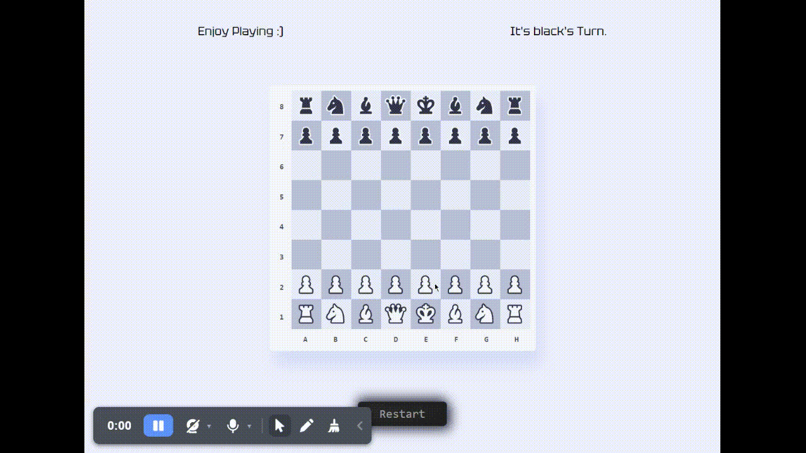

# Two Players Chess Game

This is a two-player chess game built using React, a popular JavaScript library for building user interfaces.

##### I've taken the idea from [Ania Kubów]
(https://www.youtube.com/c/AniaKub%C3%B3w)
##### The Design From [Maciej Świerczek]
(https://www.figma.com/@swierq)

## 💻 Happy coding and if you want contact with me ([@abdallahayed](https://www.linkedin.com/in/abdallah-ayed-857a5b267/) or just say Hi 👋
